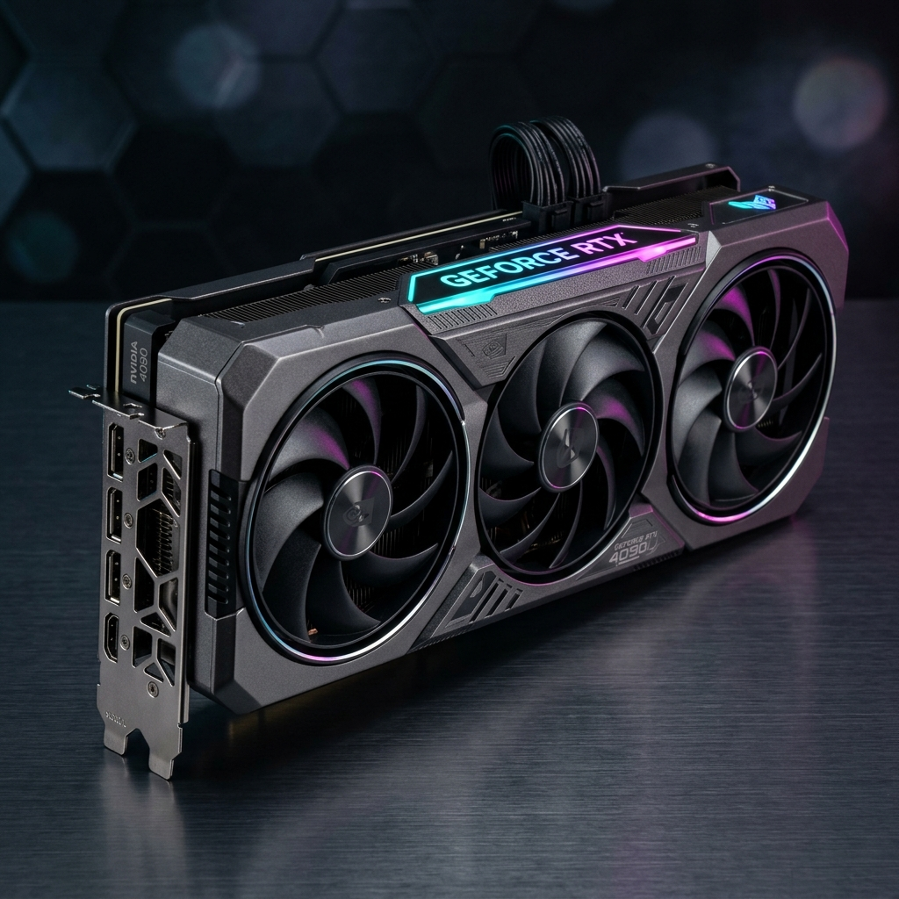

# ⚡ DreamPC — Intelligent Hardware Marketplace & AI Compatibility Lab

<p align="center">
  
</p>

<p align="center">
  <strong>An enterprise-grade, conversational PC hardware marketplace powered by dynamic specification extraction, real-time compatibility validation, and automated NLP custom build generation.</strong>
</p>

<p align="center">
  <a href="#-key-features"></a>
  <a href="#-key-features"></a>
  <a href="#-key-features"></a>
  <a href="#-key-features"></a>
  <a href="#-key-features"></a>
</p>

---

## 🌟 Executive Overview

**DreamPC** bridges the gap between hardware e-commerce and technical assembly engineering. Building a modern custom PC involves navigating complex hardware constraints (e.g. AM5 vs. LGA1700 sockets, DDR4 vs. DDR5 notch standards, thermal TDP calculations, and GPU length chassis clearances). 

DreamPC automates this process through a multi-tiered architecture:
1. **Automated Compatibility Engine**: Enforces strict hardware rules before purchase.
2. **AI Hardware Recommendation Engine**: Natural Language Processing (NLP) conversational assistant powered by Google Gemini API with local fallback.
3. **Interactive Visual Build Summary**: Real-time power analysis meter, itemized cost percentage progress bars, and compatibility checklists.
4. **Stateful Shopping Cart & Dynamic Swap**: Real-time quantity adjustments, stock pre-checking, and in-place component swaps.
5. **Secure Checkout & Fulfillment Scheduler**: Multi-step checkout with delivery date picker, coupon discounts, and immutable historical build snapshot archiving.

---

## 🚀 Key Features & System Architecture

### 1. 🤖 Conversational AI Hardware Assistant (Feature 7 & 10)
- **Natural Language Custom Build Generation**: Assembles complete, 100% compatible **7-part PC systems** (`1 CPU`, `1 Motherboard`, `1 RAM`, `1 GPU`, `1 Storage`, `1 PSU`, `1 Case`) based on user budget and use case (e.g., *"Build an AMD esports rig for $1200"* or *"Extreme 4K gaming PC with no budget limit"*).
- **Socket & Memory Synchronization**: Automatically pairs AMD Ryzen processors with AM5 (`B650/X670`) motherboards + DDR5 memory, and Intel Core processors with LGA1700 (`B760/Z790`) motherboards.
- **Dynamic Spec Card Renderer**: Renders interactive Blade HTML build cards via AJAX with embedded product photos, price breakdowns, and a 1-click **"Add Entire Build to Cart"** pipeline.
- **Store Catalog Injection & LLM Parsing**: Uses structured JSON schemas to query Google Gemini, mapping natural language outputs to verified in-stock database SKUs.

### 2. ⚡ Automated Compatibility & Power Engine (Feature 6 & 8)
- **Rule Enforcement Pipeline**:
  - **Socket Match**: Validates processor socket architecture against motherboard socket pins.
  - **RAM Generation**: Confirms DDR generation matches motherboard DIMM slot key notches.
  - **Form Factor Clearance**: Verifies Motherboard dimensions (`ATX`, `mATX`, `Mini-ITX`) inside chassis standoffs and validates GPU length clearance (mm).
  - **PSU Sizing with 1.25x Headroom**: Enforces $\text{Recommended PSU Wattage} = \lceil (\text{CPU TDP} + \text{GPU TDP} + 60\text{W}) \times 1.25 \rceil$.
- **Real-Time Cost Breakdown**:
  $$\text{Subtotal} = \sum \text{Product Prices}, \quad \text{Tax} = \text{Subtotal} \times 0.05, \quad \text{Shipping} = \$15 + (\$2 \times N_{\text{items}})$$

### 3. 📊 Visual PC Build Analytics & Summary (Feature 9)
- **Interactive Progress Bar Meters**: Visual percentage contribution gauges ($\frac{\text{Item Price}}{\text{Subtotal}} \times 100\%$) for every configured component.
- **TDP Gauge Meter**: Live system power draw meter highlighting overall wattage and PSU headroom buffers.
- **Hardware Roster**: Visual component grid with photos, categories, brand badges, and live inventory status.

### 4. 🛒 Interactive Cart & Component Swapping (Feature 12 & 13)
- **Stock Pre-Checker**: Pre-flight reservation checks prevent overselling and display real-time inventory badges (`In Stock`, `Low Stock`, `Out of Stock`).
- **1-Click Component Swapping**: Recommends in-stock compatible alternatives within the same category to customize builds without breaking compatibility.
- **Guest Session Migration**: Automatically migrates anonymous guest cart items into authenticated user accounts upon login.

### 5. 📦 Fulfillment Scheduler, Coupons & Immutable Archiving (Feature 14 & 18)
- **Fulfillment Selection**: Supports **Express Home Delivery** (with address validation) and **In-Store Warehouse Pickup** (free shipping).
- **Interactive Date Scheduler**: Integrated HTML5 date picker for selecting delivery / pickup dates.
- **Dynamic Coupon Engine**: Percentage-based and fixed-amount coupon codes (e.g., `SAVE10`) with real-time subtotal deduction.
- **Immutable JSON Snapshots**: Stores permanent JSON specification snapshots for each purchased component at the exact moment of order placement.
- **1-Click Build Reorder**: Re-verifies live inventory and restores archived configurations directly into active cart sessions.

### 6. 🎨 Modern Glassmorphism & Light/Dark Mode (Feature 15)
- **Theme Switcher**: Instant Light Mode / Dark Mode toggle with `localStorage` persistence and zero Flash of Unstyled Content (FOUC).
- **Typography & Aesthetics**: Powered by Google Fonts (**Outfit** for headings, **Inter** for body text) with floating ambient glowing background orbs and micro-animations.

---

## 🛠️ Technology Stack

| Domain | Technologies Used |
| :--- | :--- |
| **Backend Framework** | Laravel 11.x, PHP 8.2+ |
| **Database & ORM** | SQLite / MySQL / PostgreSQL, Eloquent ORM |
| **Frontend & Styling** | Vanilla JavaScript, Blade Templates, Tailwind CSS (JIT CDN) |
| **Typography & UI** | Google Fonts (Outfit, Inter), Heroicons, Custom Glassmorphism System |
| **AI / Machine Learning** | Google Gemini API (Gemini 2.5 Flash), Custom Hardware NLP Engine |
| **Testing Framework** | PHPUnit 11.x, Laravel Feature Testing Suite |

---

## 📂 Project Structure

```text
DreamPC/
├── app/
│   ├── Http/
│   │   ├── Controllers/
│   │   │   ├── Admin/ProductController.php     # Inventory & Spec CRUD
│   │   │   ├── Auth/LoginController.php        # Authentication & Rate Limiting
│   │   │   ├── BuildController.php             # Analytics & Summary Generator
│   │   │   ├── CartController.php              # Cart & Batch Addition
│   │   │   ├── CatalogController.php           # Filter & Search Engine
│   │   │   ├── ChatController.php              # Conversational AI Assistant
│   │   │   ├── CheckoutController.php          # Order Placement & Snapshots
│   │   │   ├── CouponController.php            # Promotional Discount Validator
│   │   │   └── OrderController.php             # Order History & Reordering
│   │   └── Middleware/CheckAdmin.php           # Role-Based Access Guard
│   ├── Models/
│   │   ├── Product.php, Category.php, Specification.php
│   │   ├── Cart.php, CartItem.php
│   │   ├── Order.php, OrderItem.php, Coupon.php
│   │   └── ChatSession.php, ChatMessage.php, User.php
│   └── Services/
│       ├── HardwareRecommendationEngine.php    # 7-Part Compatible PC Assembly Engine
│       ├── CompatibilityEngine.php             # Socket, RAM, Form Factor & TDP Validator
│       ├── BuildCostCalculator.php             # Real-Time Cost & Percentage Allocation
│       ├── BudgetOptimizerService.php          # Component Price Tier Balancer
│       ├── GeminiApiService.php                # Cloud LLM API Client
│       ├── ChatSessionManager.php              # Context & Store Catalog Prompt Builder
│       ├── RecommendationMapperService.php     # LLM JSON Parser & SKU Matcher
│       ├── StockCheckerService.php             # Real-Time Inventory Pre-Flight Checker
│       └── CartService.php                     # Cart Mutation & Alternative Swaps
├── database/
│   ├── migrations/                             # 12 Normalized Relational Migrations
│   └── seeders/
│       ├── DatabaseSeeder.php
│       └── ProductSeeder.php                   # Full Hardware Catalog & Photo Seeder
├── public/
│   └── images/products/                        # High-Res Hardware Photography Assets
│       ├── cpu.jpg, gpu.jpg, motherboard.jpg
│       ├── ram.jpg, storage.jpg, psu.jpg, case.jpg
├── resources/views/
│   ├── admin/products/                         # Admin CRUD Management Screens
│   ├── auth/                                   # Login & Registration Pages
│   ├── build/summary.blade.php                 # Visual Build Summary & Analytics
│   ├── cart/index.blade.php                    # Interactive Shopping Cart
│   ├── catalog/index.blade.php                 # Multi-Criteria Hardware Catalog
│   ├── chat/index.blade.php                    # Conversational AI Chat Interface
│   ├── chat/partials/build-card.blade.php      # Embedded AJAX Build Spec Card
│   ├── checkout/index.blade.php                # Checkout & Fulfillment Scheduler
│   ├── checkout/confirmation.blade.php         # Order Confirmation Screen
│   ├── layouts/app.blade.php                   # Master Shell (Dark/Light Mode & Toasts)
│   ├── layouts/navigation.blade.php            # Responsive Navbar & Cart Badge
│   └── orders/index.blade.php                  # Archived Order History & Snapshots
├── routes/
│   └── web.php                                 # Clean Modular Route Definitions
└── tests/
    └── Feature/                                # 17 Automated Feature Test Suites
        ├── BuildSummaryTest.php
        ├── CartTest.php
        ├── ChatAssistantTest.php
        ├── CheckoutOrderAuthorizationTest.php
        ├── LoginThrottleTest.php
        └── RegistrationRoleTest.php
```

---

## ⚡ Quick Start & Installation

### Prerequisites
- **PHP** >= 8.2 with `pdo`, `mbstring`, `openssl`, `curl` extensions enabled
- **Composer** >= 2.x
- **Node.js** >= 18.x *(Optional)*

### 1. Clone the Repository
```bash
git clone https://github.com/sirajul-muttakin/DreamPC.git
cd DreamPC
```

### 2. Install PHP Dependencies
```bash
composer install
```

### 3. Environment Configuration
Copy the sample environment file:
```bash
cp .env.example .env
```

Generate the application encryption key:
```bash
php artisan key:generate
```

*(Optional)* If you wish to use live Google Gemini AI recommendations, add your Gemini API key in `.env`:
```env
GEMINI_API_KEY=your_google_gemini_api_key_here
```
> **Note:** If no Gemini API key is configured, DreamPC automatically falls back to its local zero-latency **Hardware Recommendation Engine**, generating full 7-part compatible builds without network dependencies.

### 4. Database Setup & Seeding
Create the database tables and populate the store catalog with hardware components, specifications, and images:
```bash
php artisan migrate:fresh --seed
```

### 5. Start the Development Server
```bash
php artisan serve
```
Visit **`http://localhost:8000`** in your browser.

---

## 🔐 Default Access Credentials

| Role | Email | Password | Access Level |
| :--- | :--- | :--- | :--- |
| **Administrator** | `admin@dreampc.com` | `password` | Full Inventory CRUD (`/admin/products`), Order Management, User Views |
| **Member** | `user@dreampc.com` | `password` | Catalog, Cart, AI Assistant, Checkout, Order History |

---

## 🧪 Automated Testing Suite

DreamPC includes automated test suites covering all critical business logic, AI recommendations, authentication security, and order authorization:

```bash
php artisan test
```

### Test Coverage Summary:
```text
   PASS  Tests\Feature\BuildSummaryTest
  ✓ build summary shows empty state when cart is empty and no products passed
  ✓ build summary shows components from user cart
  ✓ build summary can accept explicit product ids

   PASS  Tests\Feature\CartTest
  ✓ a guest can add a product to their cart
  ✓ a logged in users cart persists to their account
  ✓ updating quantity to zero removes the item

   PASS  Tests\Feature\ChatAssistantTest
  ✓ asking for a pc build returns a complete seven component compatible build
  ✓ asking for an amd build selects amd processor and am5 motherboard
  ✓ asking for an intel build selects intel processor and lga1700 motherboard
  ✓ asking specifically about gpus returns gpu advice and gpu products
  ✓ asking about compatibility rules returns compatibility info
  ✓ asking for ultra 4k build selects rtx 4090
  ✓ asking about ram returns ram advice

   PASS  Tests\Feature\CheckoutOrderAuthorizationTest
  ✓ a user cannot view another users order confirmation
  ✓ a user can view their own order confirmation

   PASS  Tests\Feature\LoginThrottleTest
  ✓ repeated failed login attempts get rate limited

   PASS  Tests\Feature\RegistrationRoleTest
  ✓ a new registration cannot self assign the admin role

  Tests:    17 passed (59 assertions)
  Duration: 2.15s
```

---

## 👥 Development Team & Contributors

| Contributor | GitHub Profile | Primary Modules & Responsibilities |
| :--- | :--- | :--- |
| **Sirajul Muttakin** | [@sirajul-muttakin](https://github.com/sirajul-muttakin) | Hardware Recommendation Engine, Compatibility Engine, Build Cost Calculator, AI Assistant & UI Design System |
| **Arfa Anjum** | [@ArfaAnjum](https://github.com/ArfaAnjum) | Multi-Criteria Product Catalog, Interactive Cart Manager, Stock Pre-Checker, Database Schemas & Routing |
| **Yeasin Arafat** | [@Yeasin-Arafat](https://github.com/Yeasin-Arafat) | User Authentication & Throttling, Admin Inventory CRUD, Checkout & Delivery Scheduler, Order Archiving & Reordering |

---

## 📄 License
This project is open-source software licensed under the [MIT license](LICENSE).
